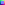

In this post, I will try to explain my work during the last month related to 3d graphics. Since this is one of the main points of the Thesis I am expecting this post to be quite long and detailed. 

## Introduction

My goals for the 3d design of the game where quite simple:

- **Useful**: the way that the user perceives the game is really important for its playability. There are a bunch of posts on the internet explaining how deeply the user interface has an impact in the game. Sometimes, the game mechanics are modified because the game designers were not able to found a good way to represent the information in the screen. In our case, we are talking about a tactical game with time limitations, so it is vital that the user can get all the information he needs as fast as possible.

  These are some examples of the articles I am referring to:

  [The Secret Behind Invisible, Inc. Is Giving You Loads Of Information](https://www.rockpapershotgun.com/2016/06/17/the-secret-behind-invisible-inc-is-giving-you-loads-of-information/):

  > "Perfect information, and lots of it, wasn’t so much of a game design problem as a UI one, and making it look good and readable was a process that took a great deal of the game’s development time."

  [How Typing Heightens Duskers' Deep-Space Horror](https://www.rockpapershotgun.com/2016/07/01/how-typing-heightens-duskers-deep-space-horror/):

  > “The more I thought about it, it was like shit or get off the pot. As soon as I put the command-line interface in the game, it was like I’d stolen the car and now I was worried about speeding or doing coke, but I’m already in trouble, so I might as well have fun,” 

  [Into the Breach's interface was a nightmare to make and the key to its greatness](https://www.rockpapershotgun.com/2018/03/05/into-the-breach-interface-design/):

  > “When we decided we had to show what every enemy was doing every single turn, and that every action needed to be clear, it became clear how bad that nightmare would be,”


- **Fast**: despite the popularity of low poly or pixel art assets in indie games, it is common to have a bad performance. This problem most of the times comes from a lack of understanding of how the 3d rendering works or because the tools that are being used are too high level to fine-tune the game for good performance. My goal is to make use of clever techniques that allow me to have a good looking game without compromising the performance.
- **Aesthetics**: how good or bad looks a game also has an impact on how the user feels about the game. In this point I don't plan to do something incredibly beautiful, what I try to do is archiving the other two goals without compromising this one.


To archive these three goals I decided to use 2D elements to represent the detailed objects in the game (characters) and 3D elements to represent the 3D space where the action occurs. 

This idea is not new and I was inspired mostly by the game Ragnarok Online. We can see how in this game they use sprites to represent the characters (detailed objects) and 3d shapes to define the space (buildings).

{:.img}


I was not sure if this approach was going to work until I discovered Octopath Traveler. This game uses newer technologies but the basic idea is the same. The results are astonishing.

{:.img}


By taking this approach I was creating a new problem: the assets. Since I wanted the game to be fully 3d (this means rotation at least around the Y-axis) I needed each character to be seen from 16 different positions. In addition to this, I also needed some specific animations and resolutions to make the game work. This time it was Dead Cells the game that gave me the solution. In this game, they decided to first create all the characters in 3D and then render them to 2D. They did this for aesthetic reasons and in my case it was because of time constraints and lack of skills. By taking this approach I could get some 3D characters online, animate them and render them. The number of images needed was not a problem since once the animation is done rendering an image is a matter of seconds. It was also from this game where I took the idea of using normal maps for the characters.


{:.img}

{:.img}

{:.img}


Now I will make a detailed explanation of how I did all of this step by step, in the same order that the steps are executed to create the final result.


## The process

### 3D models

The first step is to get a nice and adequate 3d models. Since we are going to convert them to 2d images with a low resolution it is really important to pick the right ones. I decided to go with the *POLYGON MINI - Fantasy Characters Pack* from Synty. The main advantages are its low price, plain textures and simplicity. 

{:.img}

The tool I decided to use for the rendering of the models is Blender. These models are not prepared to be used with Blender so some additional steps are needed. The first half of this video explains most of the procedure: [Synty to Blender - Importing Rigged Models](https://www.youtube.com/watch?v=W-um_2dY45Q). 


### Animation

To get the animations I have used Mixamo. Before uploading our character to Mixamo we have to clean it. This means getting rid of everything we do not need in the project. Then we have to export it to .fbx format and upload this file. Then we can use Mixamo to rig our character and download as many animations as needed.

This creates a new problem and it is that the transition between animations is not smooth. To solve this we can edit the animations with the Dope Sheet of Blender. The approach I have followed tried to be as simple as possible while giving good results:

1. Cut the idling animation to the desired length and mirror it, so the first and last frame are the same and in total it takes 120 frames.
2. Take all the other animations, cut them to 90 frames approx and centre the animation in a 120 frames window.
3. Copy and paste the first frame of the idling animation to the beginning and end of all the other animations. Choose a smooth transition.

Some animations will require extra steps or a bit more care to get the desired result. For example, the running animation requires to be edited so the character runs in the place instead of changing its position.

Another thing to notice is that even if we are working with 30 FPS we are not going to render all these frames. Probably we will render between 8 and 16 FPS, but it is more comfortable to work this way.

![[animate output image]](/tfgblog/assets/images/ezgif-5-779f18c65cb4.gif){:.img}


### 3D to 2D rendering

Before continuing it is necessary to make some decisions related to the geometry of our assets. This is a list of all the decisions I took:

- The camera will be set at 45° relative to the XZ plane.

- There will be 16 different rotation positions around the Y-axis.

- Each animation will take 4 seconds and will be animated at 8 FPS (this might change).

- Each character will be inside a 2x2x2 metre cube.

- The width of the sprites will be 64 and the height 90. This numbers came from the assumption that 1 metre in the game will be 32 pixels. 

  {:.img}

We also have to take into account that we need an orthographic camera.

One of the most important decisions taken in the 3D department is the use of normal maps. I think that the illumination is really important to make a game good looking and it is worth investing some time researching multiple options. After trying different options I decided to use normal maps for all the elements of the game that are 2D inside the 3D scene. This adds a 3D effect, while preserving the pixel art approach, that allows a better understanding of the elements of the game (and in my opinion looks amazing). 

On the other hand, I decided not to use normal maps for the textures of the 3d elements of the game (walls and floors) because by doing so it looked uncomfortable at and did not add anything to understand the game. It was just more visual noise. I decided to use pixel art textures with some baked lights. 


### Albedo rendering

In this step, we will render the colours of the sprite. This means no shadows. Shadows will come later, inside the game engine, with the usage of normal maps.

To do so we need to prepare blender. Since later we will have to match the normal map and the albedo map and normal maps tend to have problems when baked at low resolutions we will do the render at 900x600 px and then we will scale the image. We will use the Eevee rendering engine with a custom shading that will allow us to get almost completely flat colours. What we need to do to archive this is to use the texture as the emission colour and increase the emission to the maximum, that way our rendered image won't have shadows. We also make sure that there are not any other lights in the scene. 

We need to rotate the camera in increments of 22.5°, render a full animation sequence at the desired framerate and repeat. The best way to do this is by using a custom script. This will avoid problems with the transitions and will ensure that we get exactly the images that we need. It also allows us to give each image an appropriate name so later is easier to work with them.

The easiest way to rotate the camera is to create an axis that will not be rendered and attach the camera as a son of it at the desired distance (since it is an orthographic camera the distance does not matter). Then we rotate the new axis 45° relative to the XZ plane. By rotating this axis in the Y-axis the camera will revolve around the character.

[ADD SCRIPT]

### Normal map baking

The best way to bake the normal maps that I have found in Blender is with the option selected to active. It is true that by editing the shader we can create the normal map on top of the object and then render it as usual but there is one problem: when we do this we do not know where the normal map is pointing at.

With the option selected to active what we do is projecting the normal map of a high polygonal count object (in our case the character) to another with a low polygonal count (in our case it will be a plane).

To match perfectly the albedo map with the normal map some simple maths are required. We need the plane to act as a camera so it's position and dimensions must be the same as our camera.

To bake the map we need to use the Cycles render engine and create an empty image texture on the plane. Then we can select the character, set the plane as active and bake it. What will happen is that the texture of the plane now will contain the normal map of the character.

A custom script has been used to render all the images in a reasonable amount of time. 

```python
import bpy
import math

character = bpy.data.objects["Character"]
plane = bpy.data.objects["Plane"]
axis = bpy.data.objects["Axis"]
path = "./normal/"

for angle in range(0,1):
    bpy.context.view_layer.objects.active = axis
    bpy.context.object.rotation_euler[2] = 0.125*math.pi*angle
    
    character.select_set(True)
    bpy.context.view_layer.objects.active = plane

    for frame in range(0,120,5):
        bpy.context.scene.frame_set(frame)
        print(frame)

        bpy.ops.object.bake(type='NORMAL',normal_space='OBJECT',
            use_selected_to_active=True,margin = 0)

        img = bpy.data.images['normal_map']
        name = path + str(frame) + '_' + str(angle) + '.png'
        print(name)
        img.save_render(name)
```


### **Colour palettes**

#### Albedo colour palette

To archive some chromatic consistency all around the game, I have decided to create a colour palette that will be used for all the game (buttons, textures, sprites etc.). By using a custom colour palette I also can give a different feeling to the game. For example, if I want to make the game for a younger audience I will increase the saturation of the palette, or if I want it to be scary I will decrease the bright and the saturation.

Since the game does not have enough depth to need a really specific colour palette I have created a standard one that can be changed in the future. 

The colour palette will be composed of 64 different colours. 8 of them will be grey shadows with and without transparency. The others will be 14 different colours with 4 shadows of each colour.

From the 14 colours, 8 of them are really basic ones to make sure that I have all the basic covered and the other 6 are specific colours that try to fill the gaps. For example, a different green that fells in between yellow and green that is used for the skin of the goblins.

To create different shadows, I have increased the saturation and decreased the bright for the darker colours. I also have used the hue shifting technique to make the colours look a bit more interesting.

To do this I have used Gimp. with one layer for the saturation, another for the bright and 4 layers for the hue. Each one of the hue layers has the same colours but with the hue shifted a bit. By using this method I can make fast changes on the colour palette, altering just one attribute individually, that allow me faster prototypes.

[ADD PALETTE IMAGE]

#### Normal map colour palette

By choosing a colour palette for the normal map and using it to index the original colours we can manipulate how the shadows will look in the final product. I intended to have sharp shadows that imitate a cartoonish style.

To make this I just made a colour palette based on the colour that represents no inclination and 16 colours that represent high inclination from 16 different positions.

{:.img}

### Image editing

Because of the huge amount of images that have to be processed for each character (16 angles x 6 animations x 8 FPS x 4 s = 3072 images) this process has to be automated.

Archiving this was quite complicated and I have tried different approaches (gimp, ImageMagick, OpenCV etc.) but at the end what worked the best was to use scikit-image for loading and redimensioning the images and custom functions that work with NumPy arrays for the rest of actions.

One problem that I found when trying to change the colour palette of the images is that the colours of the rendered albedo images were not completely flat. During the rendering process, some colours changed slightly so when applying the new colour palette pixels with different colour appeared in a place that was supposed to be the same colour as its surroundings. To solve this, I have created a custom function that reduces the number of colours in the image. It takes a limit value and creates a colour palette based on the colours of the pixels that have a bigger euclidean distance than the specified limit to all the colours of the palette.

```python
def reduce_colors(img, umbral):
    '''The function is really slow, but gets the job done'''
    colors = list()
    for y, row in enumerate(img):
        for x, pixel in enumerate(row):
            dist = float("inf")
            index = 0
            for pos, color in enumerate(colors):
                new_dist = np.linalg.norm(color-pixel)
                if new_dist < dist:
                    dist = new_dist
                    index = pos
            if dist > umbral:
                colors.append(pixel)
            else:
                img[y][x] = colors[index]
    return img
```

After this has been done, the script takes another image that stores the palette, reads all the colours and stores them in an array.

```python
def get_colors(img):
    colors = set()

    for y in img:
        for pixel in y:
            colors.add(tuple(pixel.tolist()))

    return np.asarray(list(colors))
```

Then another function reads the original image and remaps it with the colours of the palette. This can be done using ImageMagick or Gimp, but the results were not consistent and a custom script allows me to have better control over the output.

```python
def index_colors(img, palette):
    '''This one is also quite slow'''
    for y, row in enumerate(img):
        for x, pixel in enumerate(row):
            dist = float("inf")
            index = None
            for pos, color in enumerate(palette):
                new_dist = np.linalg.norm(color-pixel)
                if new_dist < dist:
                    dist = new_dist
                    index = pos
            img[y][x] = palette[index]
    return img
```


### Game engine

The next step is to include the textures in the Godot game engine. To do so first we need to create two animated textures, one for the normal map and another for the albedo map. Due to the number of textures and how slow is the procedure inside the game engine, this process has to be automated. This is easy since the structure of the Godot files is human readable and simple.

[ADD SCRIPT]

Once we have these textures we create a spatial material that includes these two textures and a flag that indicates that we want a transparent background.

On top of all of this, the game engine also allows us to use techniques like SSAO, DOF and many others. In this article, we can read a brief explanation of most of them: https://docs.godotengine.org/en/stable/tutorials/3d/environment_and_post_processing.html


## Conclusion

First of all, I would like to clarify the amount of experimentation and trial and error that there is behind this procedure. I can't remember not even one idea that worked at the first attempt. Some days were spent trying things that at the end never worked.

Then I would like to highlight the amount of learning that there is behind this workflow. Blender basics and rendering, animation with Mixamo and blender, textures, UV mapping, normal maps, colour palettes, image editing with Numpy, Gimp, ImageMagic, OpenCV, some colour theory, scripting for Blender, Godot game engine, Blender shaders etc.

And to conclude I would like to say how happy I am with the final product. Now the game has a defined style that is consistent and that I think looks awesome.


[ADD IMAGE OF FINAL PRODUCT]

