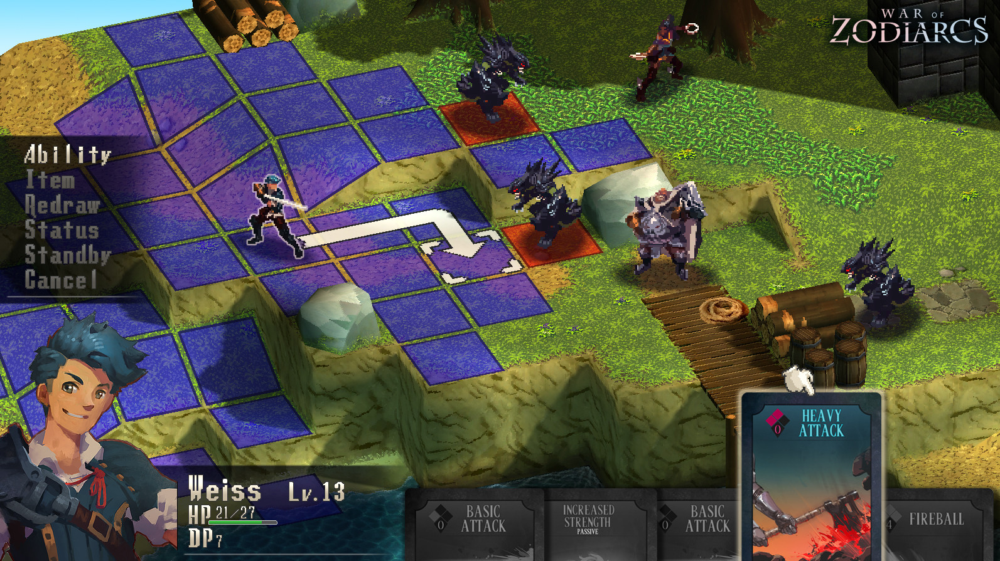
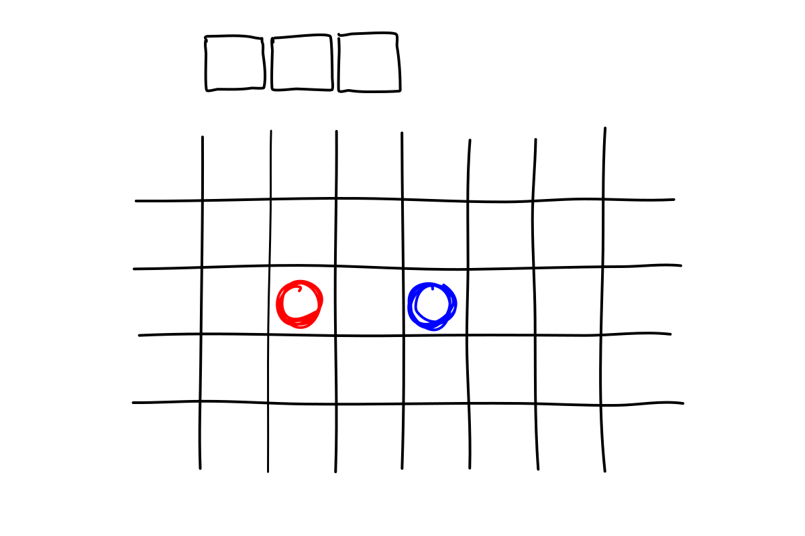
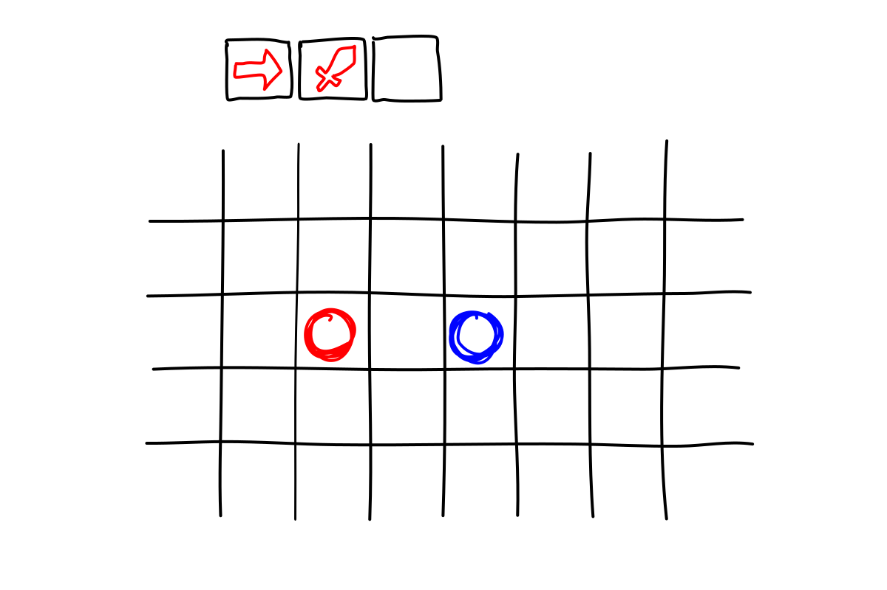
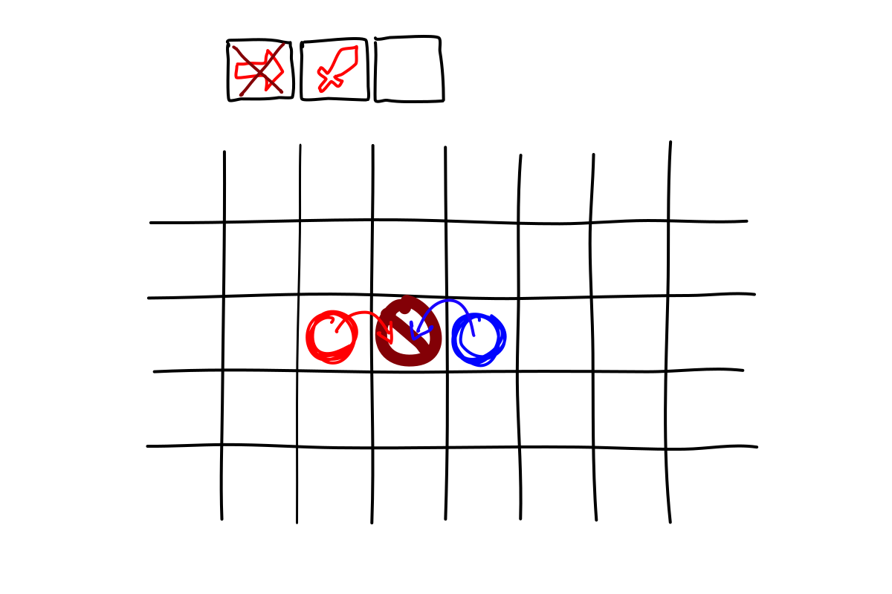
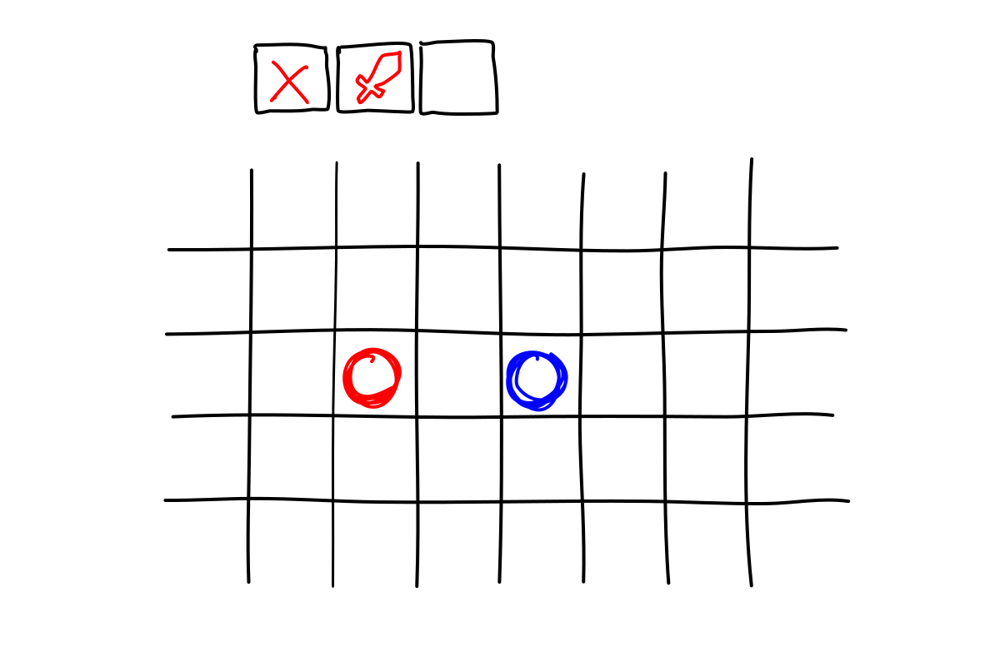
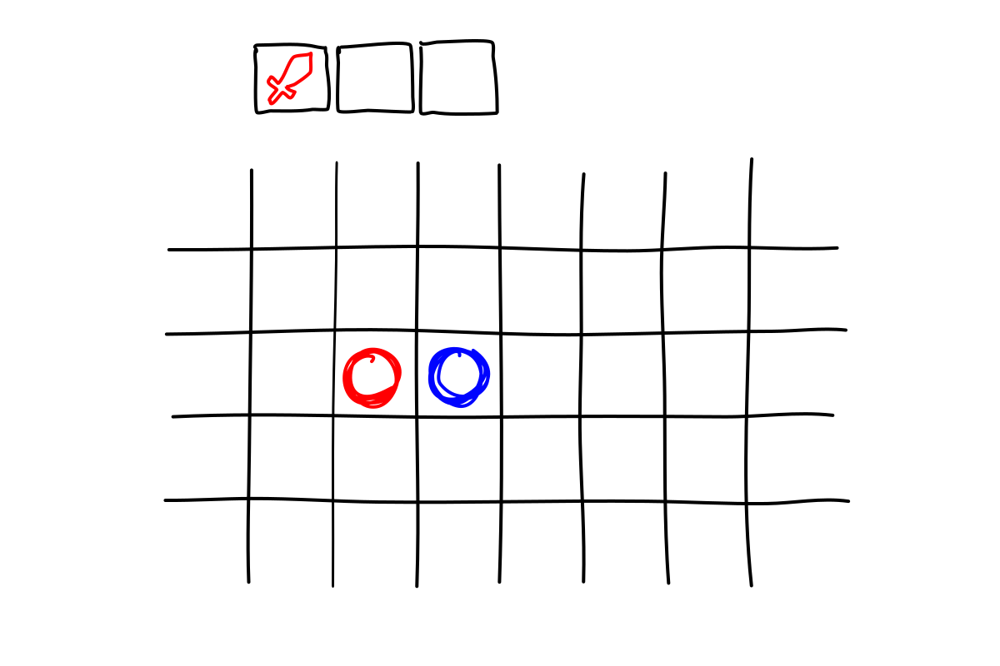
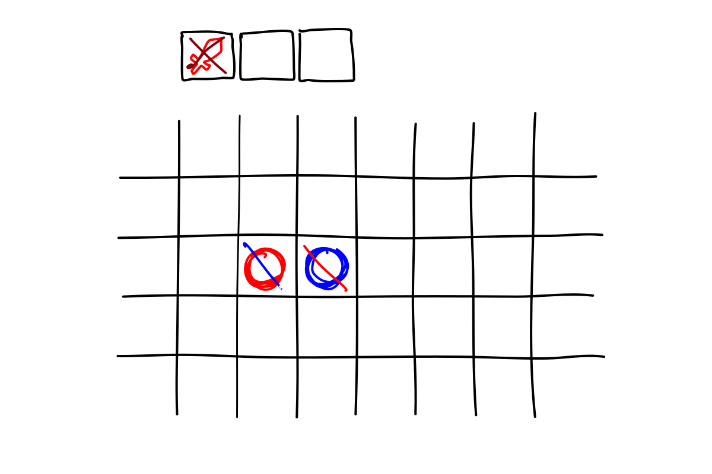

## Introduction to the game

The game is a tactical strategy game. The action takes place in a map where each entity occupies one discrete position. Each entity belongs to a team and has a set of abilities which has to use in order to archive certain goal that shares with all his team.

The next image should be useful to have a basic idea of which kind of game it is:

{:.img} 

But our game has two big differences compared to other tactical strategy games:

1. **Our actions are ruled by the time**: this means that we will be able to execute one action every certain amount of seconds. This is the reason why I have decided to implement an action buffer.

   Imagine that we want to move 4 tiles in the same direction. We can press the movement button, wait for 3 seconds so the cycle finishes, pres again the button, wait for another 3 seconds and so on. Or with the action buffer we can press 4 consecutive times the movement button and all this actions will be stored in it. In each cycle the next action in the buffer will be executed. This allows the user to focus more in the strategy and less in the timing.

2. **All the actions are executed at the same time**: instead of taking turns to execute the actions in our game all the actions are executed together in two sub-cycles: ability and movement.

## Explanation of one game

Now I will try to make a really detailed explanation of how a game should be developed. With this I hope that there is no doubt about how the game works:

1. First we open our graphical client and get connected to a game

2. Once the connection has been done we will see the representation of the map and some other UI elements that give us information about the match.

   {:.img}

3. We will have some seconds to design our strategy and decide our first movements. We have decided that the first thing we want to do is move 1 tile to the north and then attack the enemy that is there, so we add this actions to the action buffer.

   {:.img}

4. The first cycle ends and our first action gets executed, but the enemy also has decided to move. Both entities collide and the action does not get executed.

   {:.img}

5. Now the enemy is not in the adjacent square (as we had planned it was going to happen) so we empty our action buffer and change the strategy. 

   {:.img}

6. Our new strategy will consist in wait for him to approach us and then attack.

   {:.img}

7. The first action (waiting) gets executed and the enemy approach us as planned.

   {:.img}

8. We are able to attack the enemy but he also attacks us.

   {:.img}

Of course the real game will be a bit more complex and interesting, but I think in this example we have been able to see some of the main features of the game: 

- Collisions of actions.
- Not being able to predict the moves of our enemies.
- The use of the action buffer.

## More detailed description

### Map

The map has the shape of a rectangular grid. In each position of this grid there can be three types of terrain:

- **Floor**: The entities can occupy this space and it does not blocks abilities.
- **Walls**: The entities can not occupy this space and it blocks abilities.
- **Holes**: The entities can not occupy this space and it does not block abilities.

### Entities

There can be three types of entities:

- **Passive entities**: Objects that occupy positions but do not execute actions.
- **Active entities**: Objects that occupy positions and in each turn execute actions.

- **Players**: Real players that occupy positions and can execute abilities. The main difference is between the active entities and the players is that the active entities do not take in to account the state of the game when executing actions.

Each entity has:

- An amount of HP
- A set of actions which can execute

### Actions

The actions have to be executed by an entity and have effect over a set of entities. The actions can be executed inside an area which position is defined in relation to the position of the entity that executes the action. Each action can involve zero entities, just the emitter, or the emitter and a set of receivers. 

There can be three types of actions:

- **Movement**: This actions just change the position of the player which executes the action.
- **Passive actions**: This actions are executed automatically in each turn
- **Active actions**: This actions need to be executed by an entity

Each action has:

- **Emitter**: The entity that executes the action
- **Receiving position**: The position which receives the action. We use a position instead of an entity because maybe there are more than one entity in that position or the action has an effect area. By just using a position then we can retrieve the set of entities inside the area.
- **Action**: describes what happens to the all the involved entities.

