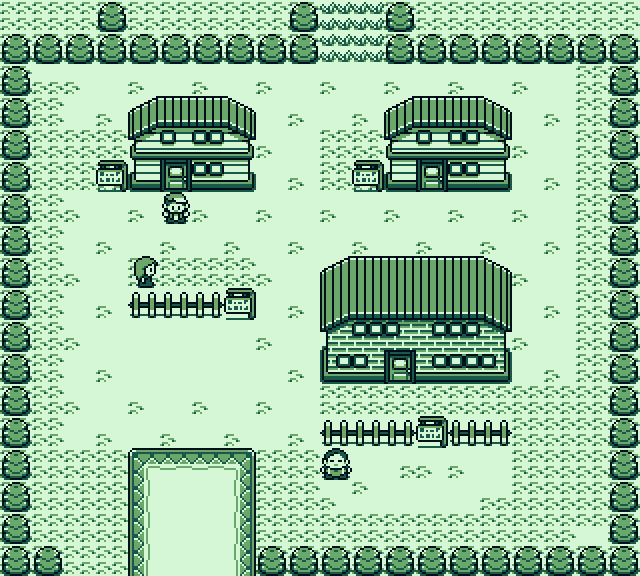
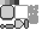

## Game engine

As the game engine I have decided to use [Godot](https://godotengine.org/) since it is growing in popularity, it covers all my necessities and has some advantages over other engines:

- It is easy to work with, since it contains all the tools needed for the graphics.
- It allows python programming, so I can re-use most of the code of the server.
- It is highly configurable.
- It has a really flexible license so I do not have to worry about it regardless of the use I make.

## Objective of the graphical design

The goal with the graphics in this game is to design a pleasant graphics that allow the user to easily identify all the important elements of the game while using as less resources as possible. This means that the focus of the graphics is not to make them realistic or beautiful, but useful.

## 2D UI

By 2D user interface I am refering to all the elements that are displayed without perspective in the game, its positioning, size, design, colour choices etc.

### Inspiration

The inspiration for the layout is almost any game I have played. I am not a professional GUI designer so I have tried to be conservative in this department. The ideas behind this is that if I do the  same that most of the games do is it harder to do it wrong and that the user will be able to use the knowledge learned in other games in my game.

The main inspiration for the graphical elements used are the old Pokemon games. After watching [this](https://www.youtube.com/watch?v=gwF0L55kIgg) video about it's pixel art I thought that following a similar approach to design the GUI should be way faster and look good. Old Pokemon games for the game-boy colour used a 4 colour palette and a tile system. Each tile was a square of 8x8 pixels.

{:.img}

### My approach

First I need to create a spreadsheet with all the elements that I will need for creating the UI. The tool chosen to do this is Gimp. The colour palette will be in grey scale to keep thing simple and make sure that the bright gap between the colours is consistent. In this example I have used 20%, 40%, 60% and 80% brightness. 

{:.img}

After this, using 

## 3D graphics

## Techniques

Right now is too soon to talk about which graphical techniques are going to be used, but some of the most interesting and that the graphical engine allows to use are:

-  [Lightmap](https://en.wikipedia.org/wiki/Lightmap) 
- [Ambient oclusion](https://en.wikipedia.org/wiki/Ambient_occlusion#Implementation)
- [Low poly 3D models](https://en.wikipedia.org/wiki/Low_poly)
- Pre-rendered models 

