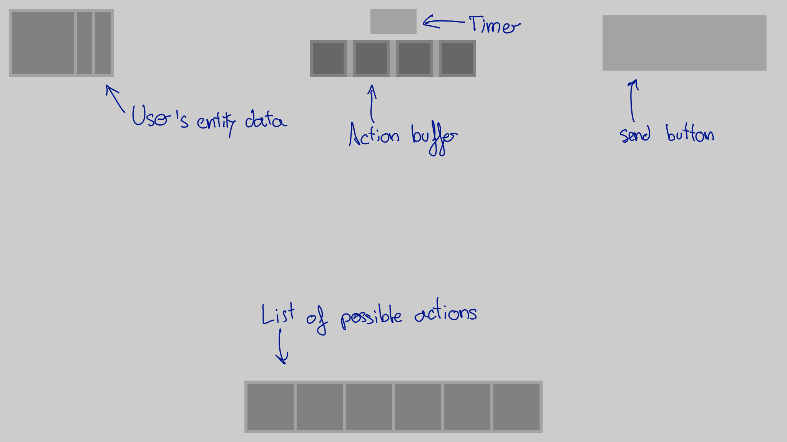
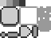
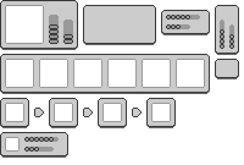
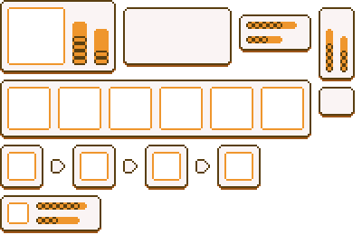
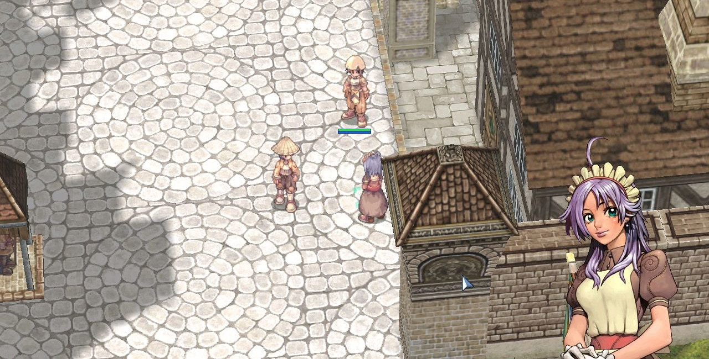

## Game engine

As the game engine I have decided to use [Godot](https://godotengine.org/) since it is growing in popularity, it covers all my necessities and has some advantages over other engines:

- It is easy to work with, since it contains all the tools needed for the graphics.
- It allows python programming, so I can re-use most of the code of the server.
- It is highly configurable.
- It has a really flexible license so I do not have to worry about it regardless of the use I make.

## Objective of the graphical design

The goal with the graphics in this game is to design a pleasant graphics that allow the user to easily identify all the important elements of the game while using as less resources as possible. This means that the focus of the graphics is not to make them realistic or beautiful, but useful.

## 2D UI

By 2D user interface I am refering to all the elements that are displayed without perspective in the game, its positioning, size, design, colour choices etc.

### Inspiration

The inspiration for the layout is almost any game I have played. I am not a professional GUI designer so I have tried to be conservative in this section. The ideas behind this is that if I do the  same that most of the games do is it harder to do it wrong and that the user will be able to use the knowledge learned in other games in my game. This is the layout I have chosen:

{:.img}

The main inspiration for the graphical elements used are the old Pokemon games. After watching [this](https://www.youtube.com/watch?v=gwF0L55kIgg) video about it's pixel art I thought that following a similar approach to design the GUI should be way faster and look good. Old Pokemon games for the game-boy colour used a 4 colour palette and a tile system. Each tile was a square of 8x8 pixels.

{:.img}

### My approach

First I need to create a spreadsheet with all the elements that I will need for creating the UI. The tool chosen to do this is Gimp. The colour palette will be in grey scale to keep thing simple and make sure that the bright gap between the colours is consistent. In this example I have used 20%, 40%, 60% and 80% brightness. 

{:.img}

Then, using the program called [Tiled](https://www.mapeditor.org/) I create the GUI elements.

{:.img}

The two main advantages of this approach are:

- **Fast iterations:** it is easy and fast to create new UI elements.
- **Fast changes**: by modifying the tile set all the UI elements get modified, so if I want to try a new colour palette or more rounded borders I just have to make a fast change in the tile-set image.

The next step is choosing the colour palette. To do this I want to use the hue shifting technique. This is something that still has to be done, this is just a temporary example:

{:.img}

### Multiple screen resolutions

For a 720p screen resolution each tile has a size of 8x8 pixels (even if it looks like 4x4). If we want to use the interface in a 1440p screen the UI would look too small, but thanks to the choice of using pixel art I can just scale the image by two, having each tile a size of 16x16 pixels, and it will look exactly the same. The same happens with 1080p screens, but this time the image must be scaled 1.5 times, generating tiles of  12x12. 

## 3D graphics

### Inspiration

The main inspiration cames from Ragnarok Online. This game uses a low poly approach with detailed textures that help us to understand the environment and for the elements that require more detail they just use [sprites](https://en.wikipedia.org/wiki/Sprite_(computer_graphics)):

{:.img}

A more modern example of this kind of graphics is Octopath Traveler:

In Octopath Traveler we can see that even if the basic idea is the same, the usage of more sophisticated lights, camera focus, shaders etc. creates a really nice scenario. 

### The sprites

One of my biggest problems is where to find the sprites. I would to include a camera that is able to rotate around the Z axis, but to archive this more or less smoothly I need lots of sprites from different positions. The solution can be found in the development of [Dead Cells](https://dead-cells.com/). They design their characters in 3d and the transform them to 2D. A more detailed explanation can be found [here](https://www.gamasutra.com/view/news/313026/Art_Design_Deep_Dive_Using_a_3D_pipeline_for_2D_animation_in_Dead_Cells.php). My idea is doing something similar but with 3D characters created by someone else. Then I will use blender to convert them to 2D from lots of different positions (probably between 16 and 32).

The best option I have found so far are [this characters](https://assetstore.unity.com/packages/3d/characters/humanoids/polygon-mini-fantasy-character-pack-122084) by Synty Studios. They are cheap and in my experiments look good.

[TODO]

## Techniques

Right now is too soon to talk about which graphical techniques are going to be used, but some of the most interesting and that the graphical engine allows to use are:

-  [Lightmap](https://en.wikipedia.org/wiki/Lightmap) 
- [Ambient oclusion](https://en.wikipedia.org/wiki/Ambient_occlusion#Implementation)
- [Low poly 3D models](https://en.wikipedia.org/wiki/Low_poly)
- Pre-rendered models 

