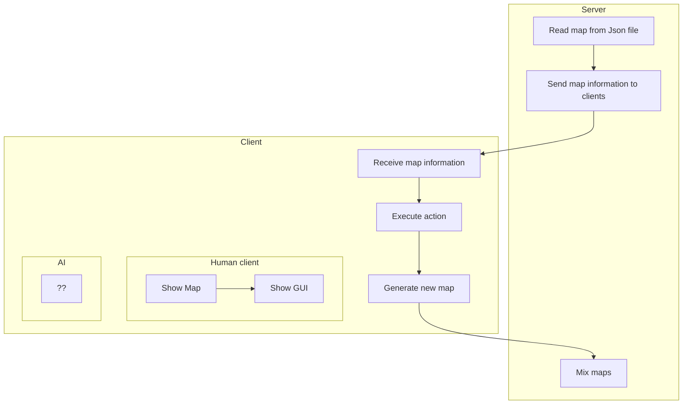

## Minimum viable product

gantt
       dateFormat  YYYY-MM-DD
       title Adding GANTT diagram functionality to mermaid

```mermaid
graph TD 
    subgraph Server
    s1[Read map from Json file] --> s2[Send map information to clients]
    s3[Mix maps] 
    end 

    subgraph Client
    s2 --> c1[Receive map information]
    --> c2[Execute action]
    --> c3[Generate new map]
    --> s3
    
        subgraph Human client
        g1[Show Map] --> g2[Show GUI]
        end

        subgraph AI
        a1[??]
        end
    
    end
    

```

