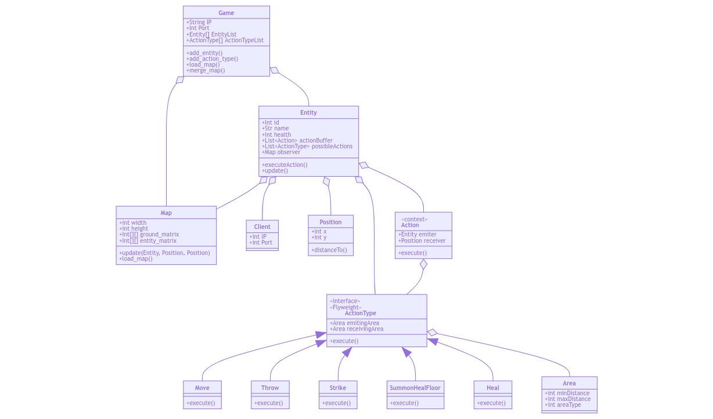
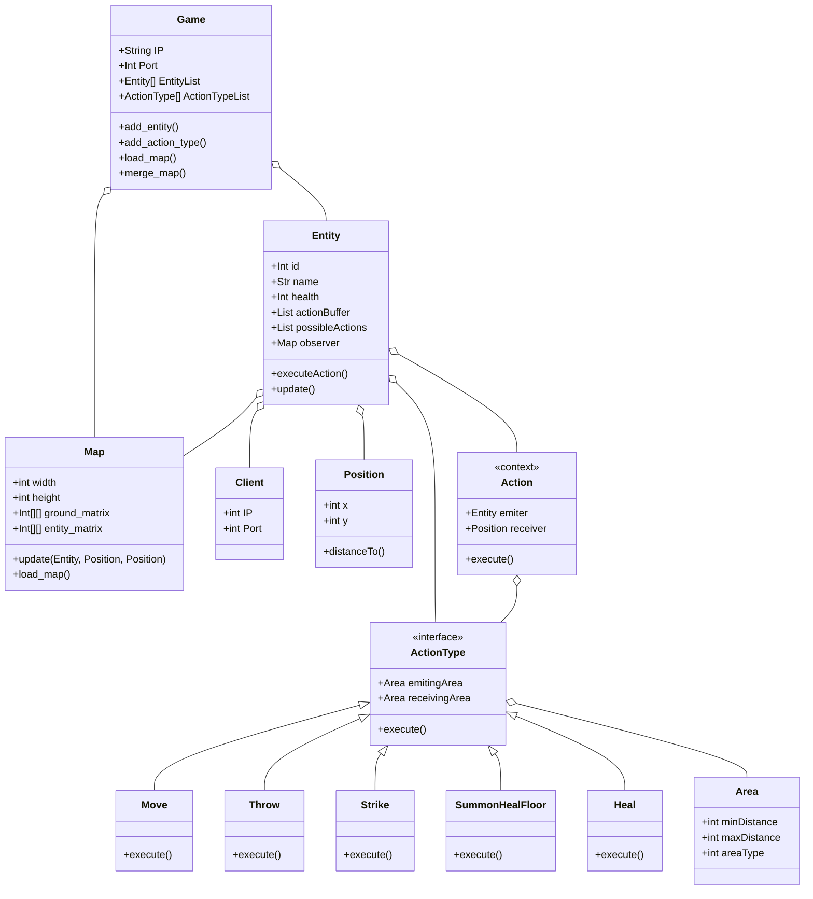

## Server class diagram

{.img}

```mermaid
classDiagram

Game o-- Map
Game o-- Entity

Entity o-- ActionType
Entity o-- Client
Entity o-- Position
Entity o-- Action
Entity o-- Map

ActionType <|-- Move
ActionType <|-- Throw
ActionType <|-- Strike
ActionType <|-- SummonHealFloor
ActionType <|-- Heal

Action o-- ActionType

ActionType o-- Area

class Game{
    +String IP
    +Int Port 
    +Entity[] EntityList
    +ActionType[] ActionTypeList
    
    +add_entity()
    +add_action_type()
    +load_map()
    +merge_map()
}

class Map{
    +int width
    +int height
    +Int[][] ground_matrix
    +Int[][] entity_matrix
    
    +update(Entity, Position, Position)
    +load_map()
}

class Entity{
	+Int id
    +Str name
    +Int health     
    +List<Action> actionBuffer 
    +List<ActionType> possibleActions
    +Map observer

	+executeAction()
	+update()
}

class Client{
    +int IP
    +int Port
}

class Position{
    +int x
    +int y
    +distanceTo()
}

class ActionType{
	<<interface>>
	<<Flyweight>>
    +Area emitingArea
    +Area receivingArea

    +execute()
}

class Action{
	<<context>>
    +Entity emiter
    +Position receiver

    +execute()
}

class Move{
    +execute()
}
class Throw{
    +execute()
}
class Strike{
    +execute()
}
class SummonHealFloor{
    +execute()
}
class Heal{
    +execute()
}

class Area{
+int minDistance
+int maxDistance
+int areaType
}
```

Each of the action types and entities have a fixed ID

The ID of the entities also tells us about the team