## Server class diagram

This is the class diagram that I have chosen to follow for the project:

{:.img}

This is one of the most important parts in the project because, even if it does not belong to the AI or graphics, this code, with some modifications, will be used in the graphical client, AI client and server.

It has taken a lot of time and iterations to get this right and after using this structure for some time I think is the good one, but maybe it suffers some minor changes.

Three different design patterns (or modifications of those patterns) have been used here:

- **Observer**: since I want to have a representation of the map as a matrix (for making some calculations faster) but I also wanted to modify all the attributes of the entities from the Entity object I have decided to make the object map a subscriber of all the entities of the game. By doing so I am able to change the position of the entity changing the attributes of it and automatically the position will be updated on the map. Since there is just one subscriber the implementation is quite simple.

- **Strategy**: I have used it to reduce the complexity of implementing new ActionType. From the [refactoring guru](https://refactoring.guru/design-patterns/strategy) website:

  > **Strategy** is a behavioral design pattern that lets you define a family of algorithms, put each of them into a separate class, and make their objects interchangeable.

  In our case, the different algorithms are the methods that define what happens in when the action is executed. It is also useful because the rest of the code does not need to know which action is executing, it just needs to know that it is an action.

- **Flyweight**: in this case, it is used to be able to store a set of actions in the action buffer (to know more about this buffer refer to the GDD). To understand this properly we need to explain a bit what the code is supposed to do:

  ActionType is a generic action that an entity can execute (for example to move) but without the specific information of who is moving or where it is moving. We store a list of ActionType inside the Entity so each entity can execute a different subset of types of actions. When we decide to execute an action we have to specify some additional information (in the case of moving, the position where we want to move) and store it in the action buffer. At some point, it will get executed and the additional information will get lost.

  To be able to handle this we have the class Action, which includes an ActionType as one of its parameters. There are also other parameters that store the specific data of the action (for example, where to move). When we execute an action we create an Action object with the desired ActionType, then we store the Action object in the action buffer. When it is time to execute the action because is the next one in the action buffer we just get the first element of the buffer, pop it, and execute the execute() method. After doing this the Action object disappears but the ActionType is still stored in the entity. By using this system we also avoid repeating a lot of information since we just create a new Action object but do not duplicate the ActionType.

  The Flyweight design pattern also includes a factory that allows us to reduce even more the amount of RAM used by storing the ActionTypes in the factory and by doing so avoiding duplicated ActionType instances in different entities. The problem is that Flyweight was not thought to be mixed with strategy, so that factory just allows us to have one kind of object but we have different kind of ActionTypes. I have tried to avoid duplicating the instances of the objects. The first idea was to implement the design pattern singleton in the ActionType object, but singleton does not allow to use inheritance because it uses static methods. Another option is to implement singleton in each one of the ActionTypes, but that would mean repeating code (and I try to make good code). At the end, I have decided just to repeat the instances because in the worst-case scenario the number of repeated instances will be the same as the number of entities (which should be really low, around 6) and the ActionType objects almost do not store any information apart from the emitting and receiving area. 

  

To conclude I would like to thanks [TonyToscana](https://github.com/TonyToscana) since he was the one that recommended me to learn design patterns and that helped me during the learning and development process. Without him this would have been really hard.