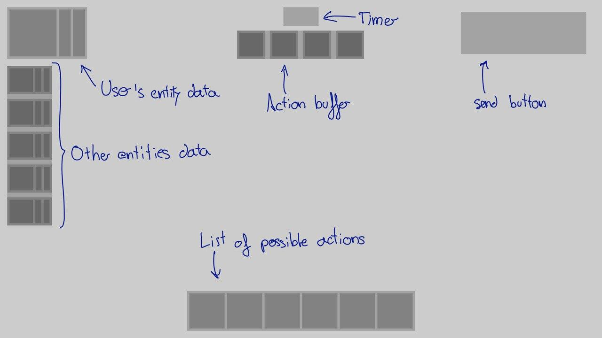

**Disclaimer**: this is anther subject in which I have no idea.

**Disclaimer 2**: Since what I am trying to do is not a full game, but a proof of concept, I am not developing a full interface. In fact, the only interface that I am planing to develop is the in-game interface and maybe a pause menu.

I am just going to talk about the in-game 2D interface. Not menus. Not 3D things. These are the steps I have followed, probably not the best ones, but they made sense in my head.

## 1. Elements

The GUI has to do mainly two things, give and get information. Now I will describe which information do the  software needs to retrieve or represent:

- **Give information to the user**:
  - Health and manna of all the entities in the game, including the own player.
  - List of actions that he can execute.
  - List of actions that he has decided to execute.
  - Time left to end the round.
- **Retrieve information from the user**:
  - Which actions the user wants to execute.
  - When is the user ready to send the action buffer.

## 2. Layout

I am not trying to be creative here. I am trying to use the experience that he has gotten in other games in my favour. In other words, I am copying the layout so it is easier for the user to understand how it works. This is what I have decided:

{:.img}